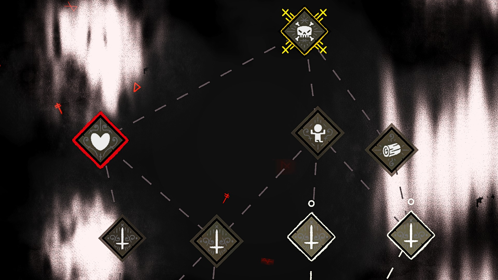
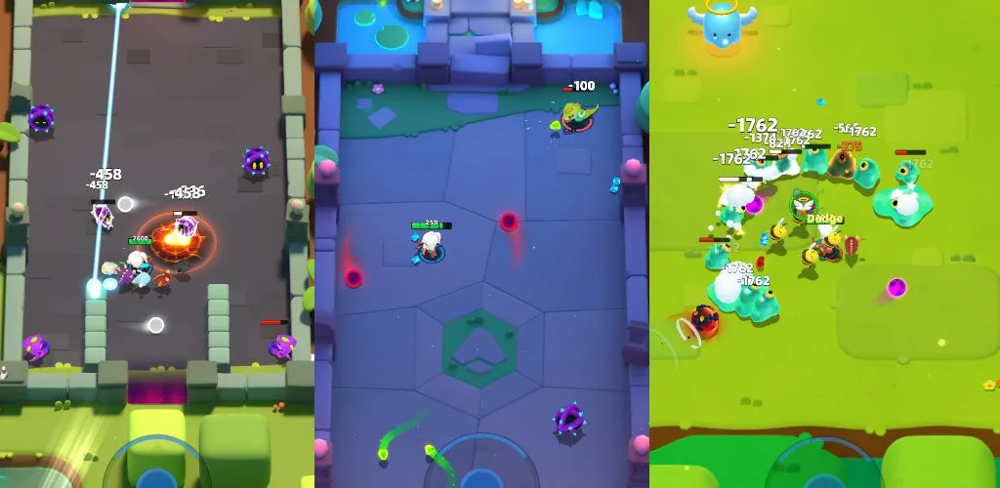
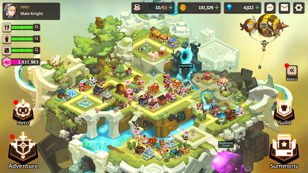

## 1 Tổng quát
Nền tảng Android + IOS.
Thể loại: Rogue like + base manage.
Không giới hạn lượt chơi nhưng giới hạn phần thưởng ở một mức nhất định.
Màn ngang.
## 2 Lối chơi:
# Game play chính:
- Game play theo kiểu một màn sẽ chia ra nhiều tuyến đường, người chơi sẽ chọn tuyến đường cho mình. Đến mỗi phòng giết quái rồi lấy power up hoặc tham gia các sự kiện tại mỗi tuyến.
- Power up: 3 loại: 
	+ Chỉ có lợi
	+ Có lợi hơn với một chút hạn chế
	+ Tăng giảm mạnh các chỉ số
- Đa dạng các phòng / tạo phòng ngẫu nhiên. 
- Mỗi phòng sẽ spawn quái và người chơi ở vị trí ngẫu nhiên. Người chơi phải giết hết quái mà không được chết.
- Vũ khí và nhân vật chọn ở ngoài.
- Mỗi khi bắt đầu màn chơi sẽ chọn 1 chiêu ngẫu nhiên (gồm 2 - 3 chiêu gồm của màn chơi và của nhân vật mặc đinh)
# Nâng cấp:
- Sử dụng vũ khí với các tính năng riêng.
- Vũ khí có 3 loại: farm, mua, gacha.
- Có thể thêm buff phụ trợ cho nhân vật mạnh hơn trước màn chơi. (food, bless...)
- Các mine stone để thêm lợi thế cho người chơi (vd: xem trước map)
- Pet để thêm phụ trợ.
- Linh hoạt trang bị khởi đầu.
- Một nhân vật khi nâng đủ cấp sẽ có thể thay đổi các kỹ năng có sẵn.
# Base:
- Xây dựng nhà để tăng nguồn tài nguyên + sức mạnh cho nhân vật.
- Mở khóa dần các chức năng của game thông qua các công trình (Nâng cấp, power up, campaign, shop...).
- Tương tác các nhân vật để tăng độ yêu thích.
- Có thêm một số các mini game: câu cá, rèn đồ...
# Tiền tệ trong game:
- Gold: đơn vị cơ bản để nâng cấp hầu hết các thứ.
- Gem: tiền tệ cao cấp khó kiếm hoặc không kiếm được, chỉ có thể có được thông qua nạp/ xem ad. Dùng để đổi sang các tài nguyên khác / mua các vật phẩm giới hạn.
- Energy: có năng lượng thì chơi xong mới được thưởng. 
- XP: dùng để lên cấp người chơi.
- Character XP: dùng để nâng cấp nhân vật và vũ khí.
- Build Materials: Các vật liệu để xây nhà.

## 3 Thị trường 
- Các game Roguelike thật sự với random map chưa có nhiều game phổ biến.
- Game qua màn lấy power up: archero 2 (top 10 action game IOS), swordash, Soul knight...
## 4 Kiếm tiền:
- Quảng cáo hồi sinh, x2 tiền (optional)
- Chặn quản cáo
- Gói đồ
- Tiền tệ trong game
- Skin.

 
